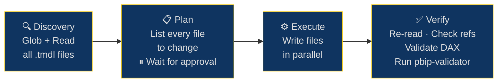
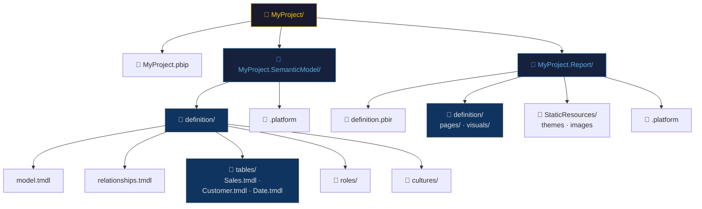
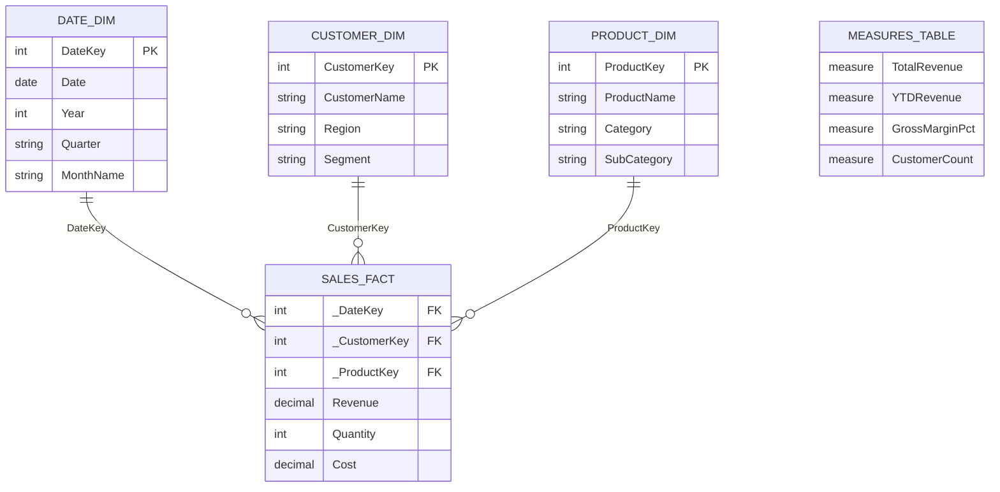

# powerbi-skill

A skill for agentic Power BI semantic model development — TMDL authoring, PBIP project structure, DAX quality rules, and agentic workflows.

> Integrated with knowledge from [data-goblin/power-bi-agentic-development](https://github.com/data-goblin/power-bi-agentic-development).

---

## Visual Use Cases

👉 **[View full visual use case page](https://bahramkhanlarov.github.io/powerbi-claude-skill-/)** — interactive HTML with star schema, workflow phases, TMDL rules, and summarizeBy reference.

---

## Agentic Workflow



---

## PBIP Project Structure



---

## Star Schema Pattern



---

## What's Included

| Area | Details |
|------|---------|
| **TMDL authoring** | `///` descriptions, tab indentation depths, name quoting, all constructs |
| **PBIP structure** | Full file layout, thick vs thin reports, forking, rename cascade |
| **DAX quality** | `DIVIDE()`, `SELECTEDVALUE()`, explicit `ALL()`, time intelligence |
| **Best practices** | Star schema, naming conventions, `summarizeBy` rules, `formatString` patterns |
| **Agentic workflow** | Discovery → Plan → Execute → Verify phases |
| **Bulk operations** | Parallel edits, cascade rename verification with grep patterns |

---

## Installation

```bash
git clone git@github.com:bahramkhanlarov/powerbi-claude-skill-.git
cp powerbi-claude-skill-/SKILL.md ~/.claude/skills/powerbi/SKILL.md
```

---

## Related

- [data-goblin/power-bi-agentic-development](https://github.com/data-goblin/power-bi-agentic-development) — Power BI agentic development skill marketplace
- [Microsoft TMDL overview](https://learn.microsoft.com/en-us/analysis-services/tmdl/tmdl-overview)
- [Microsoft PBIP overview](https://learn.microsoft.com/en-us/power-bi/developer/projects/projects-overview)
